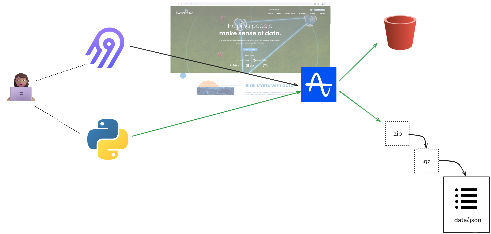

# Extracting Website data from Amplitude


_figure 1_

## The Plan

**Use Case**
Data from Amplitude and MailChimp will be used to understand how web visitors relate to live events and staff blogs.

**Data Extraction Method**
This project is designed for incremental batch extraction on a daily basis from the source url, as defined in the named directory.

**Airbyte vs Custom-Built Solutions**

Connection

```python

```

Source

```python

```

Destination

```python

```

==**Future Recommendations**==
Is the source data in good shape for immediate downstream use? That is, is the data of good quality? What post-processing is required to serve it? What are data-quality risks (e.g., could bot traffic to a website contaminate the data)?
Does the data require in-flight processing for downstream ingestion if the data is from a streaming source?

## How to use this repo

**Create a virtual environment to install libraries and packages**

It’s best practice to use a virtual environment hidden in the project folder. This allows use install packages and use different versions of python. Start by creating a virtual environment:

```powershell
python -m venv venv
```

**Now, navigate to the amplitude directory and activate the environment:**

```Powershell
.\venv\Scripts\activate
```

**Install dependencies**

```Powershell
pip install requests dotenv
```

**Create an .env file and add credentials**

```plaintext
AMP_API_KEY=''
AMP_SECRET_KEY=''
AMP_DATA_REGION = 'EU Residency Server'
```
